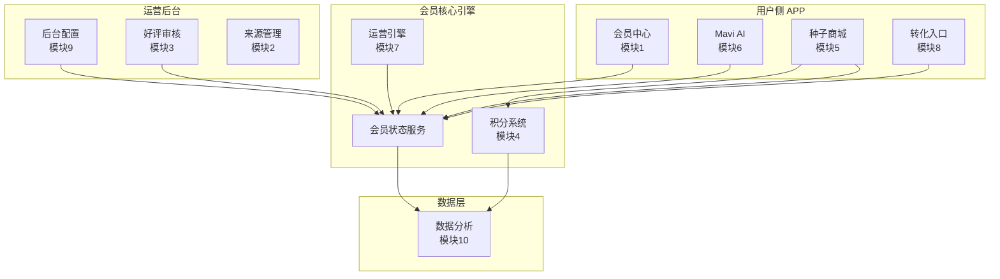

# Maygrove 会员体系 PRD v1.0

> **最终定稿版本**：v1.0  
> **撰写日期**：2026-06-15  
> **目标上线**：2026年10月（v1）；Pro 权益延至 v2  
> **首发市场**：美国（英文）  
> **关联子文档**：
> - `Maygrove-模块1-会员中心-PRD-子文档.md`
> - `maygrove_membership_PRD_modules_2_5.md`
> - `prd-modules-06-to-10-mavi-membership-operations.md`

---

## 目录

- [1. 产品概述](#1-产品概述)
- [2. 功能架构图](#2-功能架构图)
- [3. 10 模块 PRD](#3-10-模块-prd)
  - [模块1：会员中心](#模块1会员中心)
  - [模块2：会员来源管理](#模块2会员来源管理)
  - [模块3：好评送会员](#模块3好评送会员)
  - [模块4：Seed Credits（种子分）](#模块4seed-credits种子分)
  - [模块5：种子商城会员权益](#模块5种子商城会员权益)
  - [模块6：Mavi 会员权益](#模块6mavi-会员权益)
  - [模块7：会员运营](#模块7会员运营)
  - [模块8：会员转化入口](#模块8会员转化入口)
  - [模块9：会员后台配置](#模块9会员后台配置)
  - [模块10：数据埋点](#模块10数据埋点)
- [4. 全局业务规则](#4-全局业务规则)
- [5. 非功能需求汇总](#5-非功能需求汇总)
- [6. 附录](#6-附录)

---

## 1. 产品概述

### 1.1 产品愿景

Maygrove 会员体系旨在为家庭园艺用户提供**物超所值的订阅体验**，通过种子折扣、积分体系、AI 助手、包邮福利等权益组合，降低种植成本，提升用户粘性，构建可持续的园艺订阅经济。

### 1.2 等级体系（v1）

| 等级 | 定位 | 获取方式 | 核心权益 |
|------|------|---------|---------|
| **Free** | 免费基础用户 | 注册即得 | 基础种植功能、Mavi 每日 5 次、原价购买种子 |
| **Basic** | 付费订阅会员 | IAP 订阅（季/年/2年）或运营活动赠送 | 种子 6 折、无限 Mavi、每月免费种子分、包邮、24h客服 |
| **Pro** (v2) | 高端订阅会员（v2 规划） | 预留，v2 实现 | Mavi Pro + 全部 Basic 权益 + 专属权益 |

> **v1 范围**：仅实现 Free + Basic 两级，Pro 仅做入口预留。  
> **Basic 付费选项**：精简为 3 种——季付、年付（🌟最受欢迎）、2 年付。

### 1.3 核心价值主张

- **种子 6 折**：用户复购种子省 40%
- **无限 Mavi AI**：种植全周期智能陪伴
- **每月免费种子分**：兑换标准种子盒
- **全场包邮**（满 $15）：降低决策门槛

---

## 2. 功能架构图



---

## 3. 10 模块 PRD

### 模块1：会员中心

**功能定位**：用户查看会员等级、权益、订阅状态、到期时间及管理续费/取消的核心入口。

#### 等级与付费方案

| 项目 | 内容 |
|------|------|
| 等级体系 | Free（注册即得）→ Basic（付费或运营赠送）→ Pro（v2 预留） |
| **付费选项（已精简）** | **季付** / **年付** 🌟 / **2 年付** |
| 支付通道 | IAP（App Store / Google Play） |
| 升级生效 | 支付成功回调后即时生效 |

#### 关键业务规则

| 规则 ID | 规则名称 | 内容 |
|---------|---------|------|
| BR-MC-002 | Basic 升级生效 | IAP 支付成功 → 立即升级，到期时间 = now + 所选周期 |
| BR-MC-003 | 好评赠送 Basic | 运营后台手动发放；Free→Basic 到期+30d；Basic→到期延长30d |
| BR-MC-004 | 到期自动降级 | 每日 00:00 扫描，到期且 active → 降为 Free，权益立即失效 |
| BR-MC-005 | 取消不退款 | 状态变为 cancel_at_period_end，当期权益持续至到期日 |
| BR-MC-012 | 赠送不续费 | 赠送 Basic 到期后直接降级，不尝试自动扣费 |

#### 关键异常

| 异常 | 处理 |
|------|------|
| IAP 回调超时（30s） | 异步凭证验证 + 推送通知结果 |
| IAP 凭证验证失败 | 记录日志告警，标记人工处理（4h） |
| IAP 退款回调 | 立即降级为 Free，回收已用积分 |

#### 关键验收标准（AC-MC-001 ~ AC-MC-010）

- **Free 用户**：会员中心显示 Free 等级 + 升级 CTA "升级 Basic"
- **Basic 用户（订阅中）**：显示 Basic 等级 + 到期日 + 权益概览 + "管理订阅"按钮
- **Basic 用户（已取消）**：显示 "⚠️ 已取消" 标签 + "恢复续费" 按钮
- **好评赠送用户**：显示 "🎁 赠送" 标签，权益与付费 Basic 一致
- 开通页默认选中 **年付**，标注 "🌟 Best Value"
- 网络异常兜底：本地缓存等级信息 + 骨架屏 10s 降级

> 详细子文档参见：`Maygrove-模块1-会员中心-PRD-子文档.md`

---

### 模块2：会员来源管理

**功能定位**：跟踪每个会员的转化来源渠道，支持归因分析和 LTV/CAC 核算。

#### 来源渠道枚举

| 渠道编码 | 渠道名称 | 是否付费 |
|---------|---------|:--------:|
| `hardware_onboarding` | 硬件引导 | 否 |
| `seed_store` | 种子商城 | 是 |
| `membership_center` | 会员中心直接开通 | 是 |
| `review_reward` | 好评送会员 | 否 |
| `referral_link` | 好友邀请 | 是 |
| `social_ad` | 社交媒体广告 | 是 |
| `direct_unknown` | 直接/未知 | 否 |
| `manual_admin` | 后台手动 | — |

#### 归因模型

**最后点击归因（Last Click Attribution）**：以支付前最近一次有效来源为准。

#### 关键业务规则

| 规则 | 内容 |
|------|------|
| 写入时机 | 支付成功时写入 |
| 未登录用户 | 暂存 device_id，登录后关联 |
| 好评赠送自动标记 | 来源 = `review_reward` |

---

### 模块3：好评送会员

**功能定位**：用户在 Amazon 或独立站（Shopify）留下产品好评，通过**纯人工审核**验证后，获得 1 个月 Basic 会员奖励。

> **⚠️ 修复确认**：好评审核为**纯人工**，无半自动化/自动审核流程。所有验证由运营人员在后台逐一完成。

#### 审核流程

```
[用户提交] → [运营后台创建工单（pending_review）]
    → [运营人工验证：截图一致性、评论真实性、订单唯一性]
    → [通过] → 发放 1 个月 Basic 会员
    → [拒绝] → 通知用户拒绝原因
```

#### 关键业务规则

| 规则 | 内容 |
|------|------|
| 奖励内容 | Basic 会员 1 个月（30 天） |
| 发放时机 | 人工审核通过后即时发放 |
| **奖励上限** | **每个用户累计最多获赠 90 天（3 次 × 30 天）** |
| 会员叠加 | 若用户当前有 Basic，时长顺延 |
| 重复申请 | 同一订单号仅限 1 次 |
| 审核方式 | **纯人工**，运营逐单验证 |

#### 审核条件

| 条件 | 结果 |
|------|:----:|
| 截图含完整评论内容和评分 | ✅ 通过 |
| 评论评分 ≥ 4 星（5 星制） | ✅ 通过 |
| 评论链接可打开且内容与截图一致 | ✅ 通过 |
| 评论发表于最近 30 天内 | ✅ 通过 |
| 该订单号未被使用过 | ✅ 通过 |
| 邮箱与 Maygrove 账号匹配 | ✅ 通过 |

#### 关键异常

| 异常 | 处理 |
|------|------|
| 模块1会员发放接口超时 | 工单保持 `approved_pending`，每 10 分钟重试 |
| 用户提交后注销账号 | 工单自动取消 |
| Amazon 评论被删除 | 运营标记拒绝，允许重新提交 |

---

### 模块4：Seed Credits（种子分）

**功能定位**：Basic 会员专属积分体系。每月自动发放，可在种子商城兑换标准种子盒。1 Credit = 1 盒种子。

#### 发放与兑换规则

| 规则项 | 内容 |
|--------|------|
| 发放对象 | Basic 及以上会员 |
| 发放频率 | 每月 1 日 UTC 00:00 自动发放 |
| 发放数量 | Basic 每月 2 Credits（可配置） |
| 首次发放 | 开通次日即触发（不等下月 1 日） |
| 兑换比例 | 1 Credit = 任意 1 盒标准种子 |
| 兑换范围 | 所有标准种子盒（不含限定版） |

#### 失效机制

| 规则项 | 内容 |
|--------|------|
| 有效期 | 每笔积分发放后 **90 天** 自然日 |
| 失效方式 | 按批次独立过期（非 FIFO/LIFO） |
| 过期提醒 | 过期前 7 天 / 3 天 / 1 天各发一次 |
| 过期后 | 积分归零，不可恢复，不可申诉 |

#### 发芽赔偿积分

- 触发：发芽率 < 80%（客服核实）
- 赔偿：1:1 赔偿（买 1 盒赔 1 Credit）
- 有效期：90 天
- 同订单仅限 1 次

#### 关键异常

| 异常 | 处理 |
|------|------|
| 批量发放部分失败 | 重试 3 次，失败入人工队列 |
| 并发扣减 | 乐观锁重试，3 次失败返回 "请重试" |
| 对账不平 | 每日对账脚本，差异报告推运营 |

---

### 模块5：种子商城会员权益

**功能定位**：在种子商城中为会员提供专属折扣、包邮、混搭购买、发芽保障等权益。

#### 折扣体系

| 商品分类 | 会员折扣 | 说明 |
|---------|:-------:|------|
| **标准种子盒** | **6 折（40% OFF）** | 全部标准种子 |
| 指定商品（配件/土/工具） | 8 折（20% OFF） | 运营标记 |
| 限定版/联名款 | 无折扣 | 原价销售 |

#### 包邮规则

| 条件 | 包邮 |
|------|:----:|
| 会员 + 订单 ≥ $15 | ✅ |
| 会员 + 订单 < $15 | ❌ 标准运费 |
| 非会员 + 订单 ≥ $30 | ✅ |
| 非会员 + 订单 < $30 | ❌ 标准运费 |
| 积分兑换订单（金额=$0） | ✅ 免邮 |

#### 发芽保障

- **保障范围**：会员购买的种子商品
- **保障期限**：收货后 30 个自然日
- **赔偿方式**：1:1 赔偿 Seed Credits（不走现金退款）

#### 价格展示优先级

| 用户身份 | 展示逻辑 |
|---------|---------|
| Basic 会员 | 会员价 + "会员6折" 标签 |
| 非会员 | 原价 + "开会员享6折" 引导 |
| 会员过期 | 原价 + "续费会员享6折" |
| 接口异常 | 原价降级兜底 |

#### 关键异常

| 异常 | 处理 |
|------|------|
| 会员状态接口超时 | 按非会员价展示，记录降级日志 |
| 订单创建后会员过期 | 按快照价格执行，不追溯 |

---

### 模块6：Mavi 会员权益

**功能定位**：Mavi 是内置 AI 种植助手。v1 中所有会员共享同一套基础 Mavi，通过 Free 次数限制实现差异化。

#### v1 权益划分

| 权益项 | Free | Basic | Pro(v2) |
|--------|:----:|:-----:|:-------:|
| 基础种植问答 | ✅ 每日 5 次 | ✅ **不限次数** | ✅ 不限次数 |
| 植物健康诊断 | ❌ | ✅ 基础版 | ✅ 深度版 |
| 食谱推荐 | ❌ | ✅ 基础版 | ✅ 高级版 |
| 收获庆祝 | ❌ | ✅ 标准动画 | ✅ 定制化 |
| 对话历史保存 | ❌ | ✅ 7 天 | ✅ 永久 |

#### 关键业务规则

| 规则 | 内容 |
|------|------|
| Free 每日上限 | 5 次，UTC 0 点重置 |
| Basic 无限制 | 无限次使用 |
| 计次规则 | 仅用户主动发消息计次 |
| 次数耗尽 | 输入框禁用 + 升级引导弹窗 |

#### 关键异常

| 异常 | 处理 |
|------|------|
| AI 服务超时 > 10s | 返回重试按钮 |
| 敏感词命中 | 预设安全回复 |
| 服务不可用 | 连续 3 次失败后展示 FAQ 入口 |

---

### 模块7：会员运营

**功能定位**：覆盖会员全生命周期的运营能力，包括**运营活动延长 Basic 有效期**、到期提醒、降级处理、好评赠送、流失召回。

> **⚠️ 重要概念澄清**：本文档中不再使用 "体验会员（Trial）" 概念。所谓 "Trial" 并非独立等级，而是**运营活动**——通过运营操作人为延长用户的 Basic 会员有效期。具体尺度由运营人工把握。所有权益与 Basic 保持一致（种子 6 折、无限 Mavi 等）。

#### 核心运营活动

| 运营活动 | 触发条件 | 操作方式 |
|---------|---------|---------|
| **Basic 会员（运营延长）** | 用户注册、好评审核通过、召回活动 | 运营后台手动发放，延长 Basic 有效期 |
| 续费提醒 | 到期前 10 天 / 5 天 / 2 天 | 自动推送（APP内/Push/邮件） |
| 到期降级 | 到期日 00:00 UTC | 自动执行，Free 显降级页 |
| 流失召回 | 到期后 30 天未登录 | 自动推送（D+35 Push / D+42 邮件） |

#### 好评送 Basic 会员（运营延长版）

```
用户完成收获 → 引导留评
    → 用户提交评价（文字≥10字或图片≥1张）
    → 评价进入纯人工审核队列
    → 审核通过：
        → 运营在后台手动发放：延长 Basic 30 天
        → 发送通知 "🎉 感谢你的分享！送你 30 天 Basic 会员"
        → 与现有 Basic 有效期叠加
    → 审核不通过：
        → 通知用户，可重新提交
```

#### 关键业务规则

| 规则 ID | 内容 |
|---------|------|
| BR-OP-01 | Basic（运营延长）到期提醒：到期前 10 天 / 5 天 / 2 天 |
| BR-OP-02 | 到期后自动降级为 Free（到期日 00:00 UTC） |
| BR-OP-04 | **好评送 Basic：每位用户年度累计最多 90 天（3 次 × 30 天）** |
| BR-OP-05 | 好评审核流程：**纯人工**，无自动审核环节 |
| BR-OP-06 | 运营延长的 Basic 与付费 Basic 可叠加（有效期后延） |
| BR-OP-07 | 流失用户定义：到期后连续 30 天未登录 |

#### 关键异常

| 异常 | 处理 |
|------|------|
| 降级任务执行失败 | 重试 3 次（间隔 5 分钟），失败告警 |
| 好评审核超时 > 24h | 自动升级优先级，通知运营 |
| Push 发送失败 | 降级为 APP 内通知 + 邮件 |
| 召回链接过期 | 引导至标准会员页面 |

---

### 模块8：会员转化入口

**功能定位**：在 APP 各关键触点部署会员推广入口，最大化 Free → Basic 转化。

#### 转化入口矩阵

| 入口位置 | 展示内容 | 目标用户 | 频率 |
|---------|---------|---------|:----:|
| 「我的」→ 会员卡片 | 等级标签 + "升级" CTA | Free 用户 | 永久 |
| 首页推荐流 | 会员价值卡片 | Free 用户 | 每周 1 次 |
| Mavi 对话页 | 次数耗尽 → 升级引导弹窗 | Free 用户 | 次数耗尽时 |
| 种子结算页 | 会员价对比提示 | Free 用户 | 每次结算 |
| 硬件购买结算页 | 会员加购推荐 | 新用户 | 首次购买 |
| Push 通知 | 会员推广推送 | 高潜力 Free 用户 | 每月 ≤ 2 条 |

#### 种子结算页对比示例（已应用 6 折修正）

```
💎 升级 Basic 会员
当前订单：$5.99/盒
会员价：  $3.59/盒（6折）
本次省：  $2.40
全年省：  ~$67
[开通 Basic 省更多 →]
```

#### 关键业务规则

| 规则 | 内容 |
|------|------|
| 硬件加购仅对首次购买用户展示 | 已绑定设备不展示 |
| 首页卡片每周最多 1 次 | 关闭后 7 天不重复 |
| 推广 Push 仅对高潜力用户 | 标准：完成过收获 / 使用 Mavi ≥ 3 次 / 浏览商城 ≥ 2 次 |
| Push 频率 | Free 用户每月最多 2 条 |
| 支付失败挽留 | 24h 发送提醒，72h 取消未支付订单 |

---

### 模块9：会员后台配置

**功能定位**：运营后台 Web 管理界面，提供定价、权益、规则、积分发放、好评模板的灵活配置能力。

#### 定价配置

| 付费选项 | 原价占位 | 说明 |
|---------|:-------:|------|
| **季付** | $29.99/月 | 灵活 |
| **年付** 🌟 | $24.99/月 | 最受欢迎，默认高亮 |
| **2 年付** | $19.99/月 | 最高性价比 |

> 定价修改须经审批流程（上级审批），支持立即生效和定时生效。

#### 配置中心功能

| 配置项 | 审批要求 | 生效方式 |
|-------|:-------:|---------|
| 定价修改 | ✅ 须审批 | 立即 / 定时 |
| 等级规则 | ❌ 无需审批 | 即时生效 |
| Credit 发放规则 | ❌ 无需审批 | 仅对新事件生效 |
| 好评模板 | ❌ 无需审批 | 支持时间段配置，到期自动回滚 |

#### 核心指标看板

| 指标类别 | 指标 | 刷新频率 |
|---------|------|:-------:|
| 会员概览 | 总会员数、日新增、日活跃 | 实时/T+1 |
| 转化漏斗 | 浏览→对比→开通→支付成功率 | 实时 |
| 收入 | MRR、ARR、LTV | T+1 |
| 留存 | 次日/7日/30日留存率 | T+1 |
| 好评送会员 | 提交数、通过率、赠送数 | 实时 |

---

### 模块10：数据埋点

**功能定位**：标准化会员体系全链路埋点方案，覆盖会员中心、支付转化、积分系统、好评送会员、留存流失等。

#### 核心事件分类

| 事件类别 | 关键事件 |
|---------|---------|
| 会员中心 | `member_center_view`, `member_center_upgrade_click`, `member_center_cancel_subscription` |
| 支付转化 | `member_purchase_page_view`, `member_plan_select`, `member_payment_success`, `member_subscription_activated` |
| 种子分 | `credit_earned`, `credit_spent`, `credit_expired` |
| 好评送会员 | `review_submitted`, `review_manual_approved`, `membership_granted_by_review` |
| 留存流失 | `member_retention_d1/d7/d30`, `member_churn`, `member_churn_return` |

#### 完整转化漏斗

```
浏览入口 → 进入购买页 (member_purchase_page_view)
    → 查看权益对比 (member_center_benefit_compare_view)
    → 选择方案 (member_plan_select)
    → 开始支付 (member_checkout_start)
    → 支付成功 (member_payment_success)
    → 订阅激活 (member_subscription_activated)
```

#### 埋点规范

| 规范 | 内容 |
|------|------|
| 上报方式 | 实时 + 批量（每 30s） + 延迟补报 |
| 金额单位 | 美分（cents） |
| 命名规范 | 全小写 + 下划线：`模块_动作_对象` |
| 保留周期 | 原始数据 180 天，聚合数据永久 |
| PII 保护 | 禁止上报姓名/邮箱/地址 |

#### 告警规则

| 告警 | 条件 |
|------|------|
| 支付成功率异常 | < 80% 且较前 7 日均值下降 > 10% |
| 转化漏斗骤降 | 某步骤环比下降 > 20% |
| 月流失率异常 | > 15% |
| Credit 异常发放 | 单日 > 均值 3 倍标准差 |

---

## 4. 全局业务规则

### 跨模块规则汇总表

| 规则 | 涉及模块 | 内容 |
|------|---------|------|
| **种子折扣统一 6 折** | M1、M5、M7、M8 | 所有种子会员价 = 原价 × 0.6 |
| **好评 Basic 最高 90 天** | M3、M7 | 每个用户累计最多 90 天（3 次 × 30 天） |
| **好评审核纯人工** | M3、M7、M9 | 无自动审核，运营逐单验证 |
| **Basic 付费选项精简** | M1、M8、M9 | 仅季/年/2年 三档 |
| **运营延长 = Basic 权益** | M7 | 非独立等级，权益与 Basic 完全一致 |
| **等级体系不变** | M1、M7 | Free / Basic / Pro(v2) 三级 |
| **赠送不续费** | M1、M3、M7 | 赠送 Basic 到期直接降级，不自动扣费 |
| **取消不退款** | M1、M7 | 当期权益持续至到期日，不按比例退款 |
| **积分 90 天过期** | M4、M5 | 每批积分独立 90 天有效期 |
| **状态变更留痕** | M1、M2、M9 | 所有变更写入 membership_change_log |

### 用户等级状态机

```
[注册] → Free (active)
            │
            ├── 升级支付成功 → Basic (active)
            ├── 运营赠送 Basic → Basic (active) [来源=gift]
            │
Basic (active) → 取消续费 → Basic (cancel_at_period_end)
                → 恢复续费 → Basic (active)
                → 到期自动降级 → Free (active)
                → 运营赠送叠加 → Basic (active) [到期延长]

Basic (cancel_at_period_end) → 到期 → Free (active)
```

### 权限分级

| 角色 | 可访问范围 |
|------|-----------|
| 运营经理 | 定价配置、权益配置、等级规则、数据看板 |
| 活动策划 | Credit 发放规则、好评模板配置 |
| 数据分析师 | 数据看板（只读） |

---

## 5. 非功能需求汇总

### 性能

| 编号 | 需求 | 指标 |
|:----:|------|:----:|
| NFR-001 | 会员中心首屏加载 | ≤ 1.5s（中位网络）/ ≤ 3s（弱网） |
| NFR-002 | 开通页套餐信息加载 | ≤ 1s |
| NFR-003 | IAP 支付调起至展示 | ≤ 0.5s |
| NFR-004 | 支付成功回调至跳转 | ≤ 5s |

### 可靠性

| 编号 | 需求 | 指标 |
|:----:|------|:----:|
| NFR-007 | 支付回调到账成功率 | ≥ 99.9% |
| NFR-008 | 自动降级任务准确率 | 100% |
| NFR-009 | 积分发放伴随升级成功率 | ≥ 99.5% |

### 安全

| 编号 | 需求 |
|:----:|------|
| NFR-013 | IAP 支付凭证须服务端验证，不得仅依赖客户端 |
| NFR-014 | 会员状态变更操作日志可追溯 180 天 |

### 可用性与合规

| 编号 | 需求 |
|:----:|------|
| NFR-010 | 会员中心支持离线缓存（等级/到期日/权益摘要） |
| NFR-011 | VoiceOver / TalkBack 无障碍支持 |
| NFR-012 | 首发英文，文案支持 Localizable |
| 埋点规范 | 禁止上报 PII，金额以美分为单位 |

---

## 6. 附录

### 6.1 术语表

| 术语 | 英文 | 说明 |
|------|------|------|
| Free | Free Tier | 免费等级，注册即得 |
| Basic | Basic Tier | 付费订阅等级，种子 6 折等权益 |
| Pro | Pro Tier | 高端等级，v2 规划，含 Mavi Pro |
| 运营延长 Basic | Extended Basic | 非独立等级，运营活动延长 Basic 有效期 |
| Seed Credits | Seed Credits | Basic 会员每月免费获取的种子积分 |
| Mavi | Mavi | 内置 AI 种植助手 |
| IAP | In-App Purchase | iOS/Android 应用内购 |
| 发芽保障 | Germination Guarantee | 种子发芽率低于标准时赔偿积分 |
| 来源归因 | Source Attribution | 记录会员转化来源渠道 |
| LTV | Lifetime Value | 会员生命周期价值 |
| CAC | Customer Acquisition Cost | 用户获取成本 |

### 6.2 决策记录

| 决策 ID | 决策内容 | 理由 | 日期 |
|:-------:|---------|------|:----:|
| DEC-001 | **体验会员定位为运营活动**：非独立等级，本质是运营人工延长 Basic 有效期。等级体系保持 Free/Basic/Pro(v2) 不变 | 避免概念混淆，降低系统复杂度；运营活动不应引入额外等级状态 | 2026-06-15 |
| DEC-002 | **种子折扣统一为 6 折**：所有模块中 Basic 会员种子折扣统一为 6 折（40% OFF） | 消除跨模块不一致（原子文档存在 7 折残留），确保用户侧体验统一 | 2026-06-15 |
| DEC-003 | **好评送会员上限改为 90 天（3 次 × 30 天）**：原 12 个月上限过长 | 防止过度依赖免费通道，影响付费转化。90 天既给充分体验空间，又控制风险 | 2026-06-15 |
| DEC-004 | **付费选项精简为 3 种**：取消月付和半年付，保留季付/年付/2 年付 | 月付流失率高、ARPU 低；半年付与季付/年付区分度不足。精简降低选择瘫痪，聚焦高价值方案 | 2026-06-15 |
| DEC-005 | **好评审核为纯人工**：删除所有半自动化/自动审核描述 | 好评真实性验证需要人工判断截图、评论内容一致性，自动化误判风险高。运营投入可控 | 2026-06-15 |
| DEC-006 | Mavi Pro 延至 v2 实现 | v1 聚焦基础会员体系，Pro AI 开发周期长 | 2026-06-15 |
| DEC-007 | 定价修改须审批，Credit 规则不需要 | 定价影响收入，须严格控制 | 2026-06-15 |
| DEC-008 | 埋点金额以美分为单位 | 避免浮点数精度问题 | 2026-06-15 |

### 6.3 变更日志

| 版本 | 日期 | 变更内容 | 变更人 |
|:----:|:----:|---------|:------:|
| v1.0 | 2026-06-15 | 初始创建，整合 3 份子文档为完整主 PRD | 产品团队 |
| v1.0 | 2026-06-15 | **修复 1**：模块7 "体验会员" → "运营延长 Basic" | 产品团队 |
| v1.0 | 2026-06-15 | **修复 2**：统一种子折扣为 6 折（模块7/模块8） | 产品团队 |
| v1.0 | 2026-06-15 | **修复 3**：好评上限 12 个月 → 90 天（3 次 × 30 天） | 产品团队 |
| v1.0 | 2026-06-15 | **修复 4**：付费选项 5 种 → 3 种（季/年/2 年） | 产品团队 |
| v1.0 | 2026-06-15 | **修复 5**：好评审核确认为纯人工（删除半自动描述） | 产品团队 |

### 6.4 子文档引用

| 子文档 | 路径 | 说明 |
|-------|------|------|
| 模块1：会员中心 | `Maygrove-模块1-会员中心-PRD-子文档.md` | 完整页面描述、状态矩阵、Gherkin 验收标准 |
| 模块2~5：来源/好评/积分/商城 | `maygrove_membership_PRD_modules_2_5.md` | 完整流程、埋点、数据表设计 |
| 模块6~10：Mavi/运营/转化/配置/埋点 | `prd-modules-06-to-10-mavi-membership-operations.md` | 完整运营流程、后台配置、埋点方案 |

---

> **文档结束**
